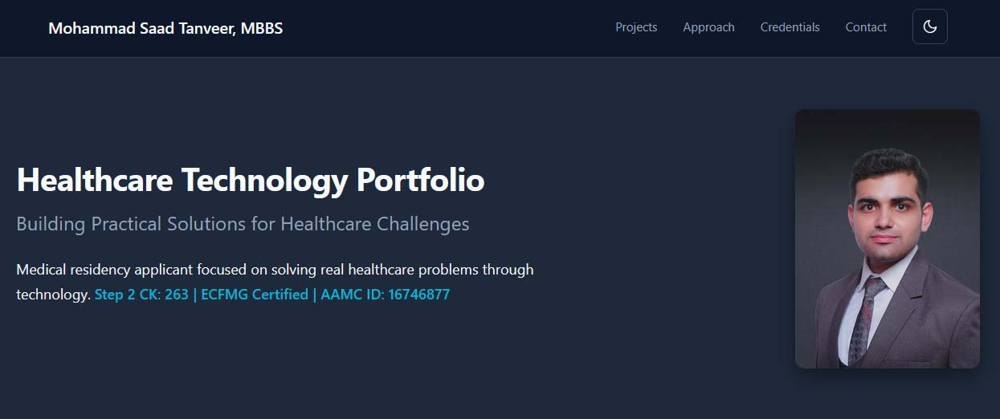

# Mohammad Saad Tanveer, MBBS - Healthcare Technology Portfolio

[](https://gphmf.github.io/Portfolio/)
[]()
[]()
[]()
[]()

<br>



**Live Site:** [**https://gphmf.github.io/Portfolio/**](https://gphmf.github.io/Portfolio/)

---

## About This Project

This repository contains the source code for my personal portfolio, designed to showcase my skills at the intersection of **medicine and technology**. As a medical residency applicant, my goal is to demonstrate a practical ability to identify real-world healthcare challenges and build effective, technology-driven solutions.

This portfolio is a **100% vanilla JavaScript** static site, built from the ground up with no external frameworks or libraries. It details two of my major projects:

1. **FULCRUM:** A comprehensive, prototype provider wellness platform aimed at addressing physician burnout.
2. **WELLNESS SIMPLIFIED:** A multilingual, evidence-based patient education platform currently in active clinical use.

---

## ✨ Key Features

This portfolio website was built to be lightweight, modern, and interactive.

- **Dual Project Showcases:** In-depth case studies for both *Fulcrum* and *Wellness Simplified*, detailing their features, technical stacks, and clinical foundations.
- **Custom Interactive Gallery:** A lightweight, zero-dependency `ImageEnlarger` class built in vanilla JS with advanced image manipulation.
  - Click/tap to enlarge images in a fullscreen modal.
  - Keyboard navigation with arrow keys (previous/next) and Escape to close.
  - Visible clickable navigation buttons on left and right sides of the modal.
  - Mouse-wheel zoom and pinch-to-zoom support on touch devices.
  - Click-and-hold panning for zoomed images with momentum scrolling.
  - Image index persistence during the modal session (resets on close).
- **Dynamic Light/Dark Mode:** A `ThemeManager` class that automatically detects and applies system color scheme preferences (`prefers-color-scheme`) with manual toggle support for the current session.
- **100% Vanilla Stack:** The entire site—including the theme manager, smooth scrolling, and advanced image modal—runs on pure, efficient, handwritten JavaScript.
- **Semantic HTML Structure:** Built with accessibility in mind using semantic HTML5 elements for improved screen reader compatibility.

---

## 🛠️ Tech Stack

| Layer | Technology | Purpose |
|-------|-----------|---------|
| **Structure** | HTML5 | Semantic content structure |
| **Styling** | CSS3 | Custom properties, dual themes, responsive layout |
| **Logic** | Vanilla JavaScript (ES6+) | All interactivity (Theme, Modal, Gallery Navigation) |
| **Deployment** | GitHub Pages | Free, fast static hosting |

**Statistics:**
- **Zero external dependencies** or frameworks
- **Lightweight:** The entire site is optimized for a fast user experience
- **Performance:** Instant navigation and smooth interactions

---

## 🚀 Getting Started

This project has **no build step** and requires no server to run.

```bash
# Clone the repository
git clone https://github.com/GPHMF/Portfolio.git

# Navigate to the directory
cd Portfolio

# Open index.html directly in your browser
# (No local server is required)
```

---

## 📁 Project Structure

```
Portfolio/
├── index.html                           # Main application file
├── app.js                               # All JavaScript (ThemeManager, ImageEnlarger classes)
├── style.css                            # All CSS styles (Light/Dark themes)
├── README.md                            # This file
├── images/
│   ├── headshot.jpg                     # Hero image
│   ├── fulcrum-homepage.jpg             # Project 1 preview
│   ├── wellness-simplified-homepage.jpg # Project 2 preview
│   ├── fulcrum-light-dark.webp          # Gallery image 1
│   ├── fulcrum-provider-cards.jpg       # Gallery image 2
│   └── ... (all 12 gallery images) ...
└── src/
    ├── favicon.jpg                      # Favicon
    └── preview.jpg                      # OpenGraph preview image for link sharing
```

---

## 📞 Contact

For any questions about this portfolio or the projects within it, please feel free to reach out.

Email: sbysgeneration@gmail.com
